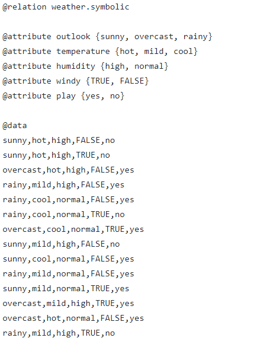
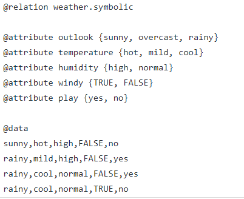

# Machine Learning with Java - Part 2 (Logistic Regression)

Regression analysis is a predictive modelling technique, which is used to investigate the relationship between the dependent and independent variable(s). It is the important tool for modelling and analyzing the data. From the data points, we draw the curve or the line and we try to fit it in such a manner that the differences between the distance between the data points to the curve or line is minimal.

In my [last article](https://tech.io/playgrounds/3771/machine-learning-with-java---part-1-linear-regression), I have explained the linear regression with the sample data points. This article focuses on the Logistic regressions and its types with simple example.

# Logistic Regression

Logistic regression is used when there are one or more independent variables that determine an outcome. It requires large sample sizes because maximum likelihood estimates are less powerful at low sample sizes than ordinary least square.

The difference with linear regression is that, linear regression output is continuous and not limited to number of possible.

<B>Example:</B> To determine, whether we can play or not based on weather data logistic regression is used.

# Types of Logistic Regression

The types of Logistic Regression are,

1.<B>Ordinal logistic regression</B>

2.<B>Multinomial Logistic regression</B>

3.<B>Binomial Logistic regression </B>

# Ordinal logistic regression

If the values of dependent variable are ordinal, then it is called as Ordinal logistic regression. Ordinal regression is used to predict the dependent variable with ‘ordered’ multiple categories given one or more independent variables. 

<B>Example :</B> To predict the belief that the tax is too high, the dependent variable ranges from strongly agree to strongly disagree and the independent variables are age and income. In this case, we will use the ordinal logistic regression.

# Multinomial Logistic regression

Multinomial logistic regression is used to predict a nominal dependent variable given one or more independent variables. It is sometimes considered as extension of binomial logistic regression.

<B> Example:</B>To understand which type of drink consumers prefer based on location in the US and age. The dependent variables would be type of the drink (Coffee, Soft Drink, Tea and Water) and the independent variables would be the nominal variable, location in US and the age (in years).

# Binomial Logistic regression

A binomial logistic regression, predicts the probability that an observation falls into one of two categories of a dichotomous dependent variable based on one or more independent variables that can be either continuous or categorical. This is often called as simple logistic regression.

<B> Example: </B>Let us predict, whether students will pass or not (i.e. The dependent variables are Pass and Fail.) in their final exam based on the internal marks , assignment submission and few other independent variables. 

# Sample Training and Testing Data

 <B> Training Data </B>      
 <B> Testing Data </B> 

<B> Notes </B>

An ARFF (Attribute-Relation File Format) file is an ASCII text file that describes a list of instances sharing a set of attributes. ARFF files were developed by the Machine Learning Project for Weka machine learning software.

# Logistic Regression Demo

@[Logistic Regression]({"stubs": ["src/main/java/com/gg/ml/LogisticRegressionDemo.java"], "command": "com.gg.ml.LogisticRegressionDemoTest#test"})

# Explanation

1. The logistic regression outputs probabilities based on the following equation:

logit(pi)=log(pi/(1−pi))=β0+β1x1+...+βkxk

the coefficients refer to each βi.

2. Odds ratios are simply the exponential of the weights
i.e.The first coefficient you have is outlook=sunny:-3.5821. Calculation of exp⁡(-3.5821) gives 0.0278 that is the corresponding value in the odds ratio table.
log(Odds(outlook=sunny)/Odds(outlook=¬sunny))

<B> It will also display the correctly classified instances and incorrectly classified instances. With that data, we can understand the accuracy of the algorithm with the datasets that we have. </B>

Note:
Next article, I will focus on next algorithm with an example and also how to use weka lib.
